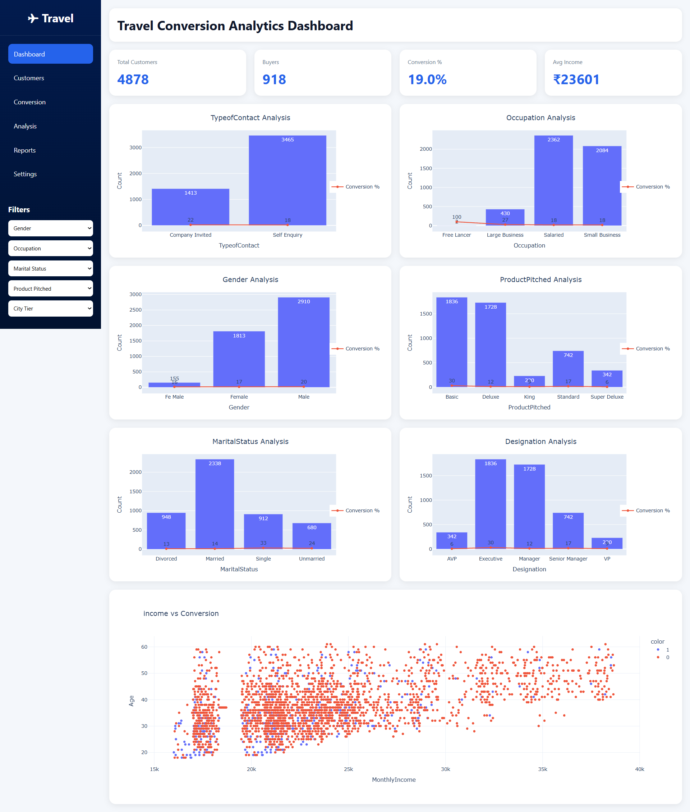

# Travel Package Conversion Analysis
## Project Overview
This project focuses on analyzing travel package customer data to understand customer characteristics, customer behavior, and travel package conversion patterns.

The project includes Exploratory Data Analysis (EDA) using Python and a Flask-based dashboard for presenting the analysis through visualizations.

## Project Objectives
1. Explore and understand the travel customer dataset.
2. Perform data preprocessing and cleaning.
3. Handle missing values.
4. Identify and remove outliers.
5. Analyze customer characteristics.
6. Study travel package conversion patterns.
7. Visualize conversion across different customer attributes.
8. Create a web-based dashboard to present the analysis.

## 📁 Project Files

The main files used in this project are listed below. Click on any file to open it directly in the repository.

| 📂 Category | 📄 File | 📝 Description |
|---|---|---|
| 📊 Dataset | [Travel.csv](Data/Travel.csv) | Dataset used for the analysis |
| 📓 Jupyter Notebook | [Travel_Conversion_EDA.ipynb](Notebook/Travel_Conversion_EDA.ipynb) | Complete Exploratory Data Analysis notebook |
| 🚀 Flask Dashboard | [app.py](Dashboard/app.py) | Flask application used to generate and serve the dashboard |
| | [index.html](Dashboard/templates/index.html) | HTML template used for the dashboard interface |
| 🖼️ Dashboard Preview | [dashboard.png](Images/dashboard.png) | Full-page screenshot of the completed dashboard |
| ⚙️ Dependencies | [requirements.txt](requirements.txt) | Python libraries required to run the project |

## Project Structure
```
travel-package-conversion-analysis/
│
├── Dashboard/
│   ├── app.py
│   └── templates/
│       └── index.html
│
├── Data/
│   └── Travel.csv
│
├── Notebook/
│   └── Travel_Conversion_EDA.ipynb
│
├── Images/
│   └── dashboard.png
│
├── README.md
└── requirements.txt
```

## 🛠️ Technologies & Libraries Used
Python
Jupyter Notebook
Pandas
NumPy
Matplotlib
Seaborn
Plotly
Scikit-learn
Flask

## 🔍 Exploratory Data Analysis
The Exploratory Data Analysis was performed using Jupyter Notebook.

The analysis includes:
- Loading and understanding the dataset
- Data inspection
- Data preprocessing
- Handling missing values
- Statistical analysis
- Outlier detection and removal
- Exploratory analysis
- Data visualization
- Travel package conversion analysis
The complete analysis can be viewed in the Travel_Conversion_EDA.ipynb notebook.

##🧹 Data Preprocessing
The dataset was loaded and processed using Pandas.
The preprocessing stage includes handling missing values and identifying and removing outliers before performing further analysis and visualization.

## 📈 Dashboard
A Flask-based dashboard was created to present the results of the analysis in a visual format.

The dashboard displays key performance indicators including:
- Total Customers
- Buyers
- Conversion Percentage
- Average Income
It also presents multiple visualizations created using Plotly.

## 📊 Dashboard Visualizations
The dashboard includes analysis based on different customer attributes, including:

Type of Contact
- Occupation
- Gender
- Product Pitched
- Marital Status
- Designation
- Income vs. Conversion

## 🐍 Flask Application
The Flask application is located in the Dashboard folder.
The [app.py](Dasboard/app.py) file loads the dataset, performs the required preprocessing, calculates the dashboard KPIs, generates the visualizations, and serves the dashboard through Flask.
The dashboard interface is provided through [index.html](Dasboard/templates/index.html).

## 🚀 How to Run the Project
1. Clone or download the repository
Download the project or clone the GitHub repository to your computer.

2. Open Anaconda Prompt or Terminal
Navigate to the project folder and then enter the Dashboard folder:
cd Dashboard

3. Install the required libraries
pip install -r ../requirements.txt

4. Run the Flask application
python app.py

5. Open the Dashboard
After starting the Flask application, open the local URL shown in the terminal.
Usually:  http://127.0.0.1:5000

## 🖼️ Dashboard Preview



## 📌 Key Analysis Areas
The project analyzes travel package conversion in relation to different customer characteristics, including:
- Gender
- Occupation
- Marital Status
- Designation
- Type of Contact
- Product Pitched
- Monthly Income
- Age
These analyses are used to explore patterns in customer behavior and travel package conversion.

## 🔄 Project Workflow
- Travel Dataset
- Data Loading
- Data Inspection
- Data Preprocessing
- Missing Value Handling
- Outlier Removal
- Exploratory Data Analysis
- Data Visualization
- Conversion Analysis
- Flask Dashboard

## 🔗 Quick Navigation
- [📊 View Dataset](Data/Travel.csv)
- [📓 View EDA Notebook](Notebook/Travel_Conversion_EDA.ipynb)
- [🚀 View Flask Application](Dashboard/app.py)
- [🖼️ View Dashboard Screenshot](Images/dashboard.png)
- [📦 View Requirements](requirements.txt)

## 📌 Project Status
The Exploratory Data Analysis and Flask dashboard have been completed.
The project is organized into separate folders for the dataset, notebook, dashboard, HTML template, dashboard preview, and project dependencies.
